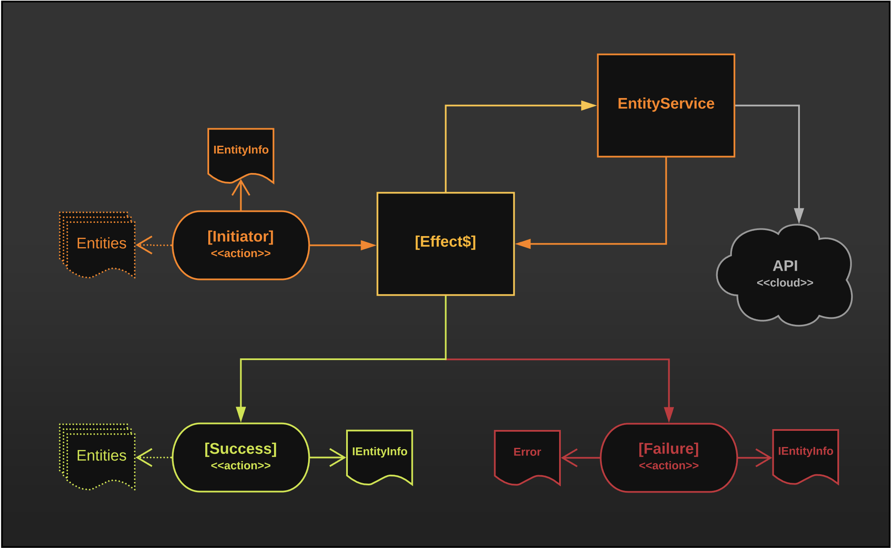

# Generic Actions

The primary interface for an application to interact with state in @ngrx is actions. **Actions** encapsulate intent, along with the information necessary to perform the requested intent. Actions are one of the key sources of "boilerplate" code with standard @ngrx, and one of the primary areas we aim to simplify with Auto-Entity. 

With @ngrx, defining actions tends to require defining action types and action classes "in triplicate", as most actions, particularly entity actions, usually require an _"initiator"_ paired with _"result"_ actions. Initiators are dispatched to request that "some action be performed", while results are dispatched in order to denote that "a requested action completed" with success or failure. Actions, therefor, tend to `trifurcate` in their actual implementation.

